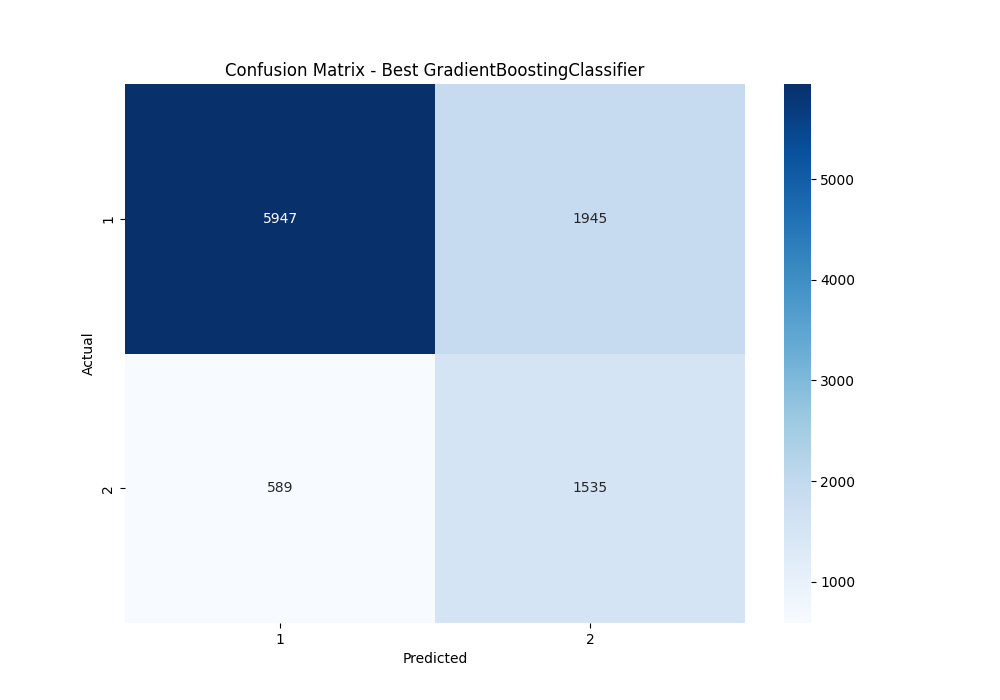
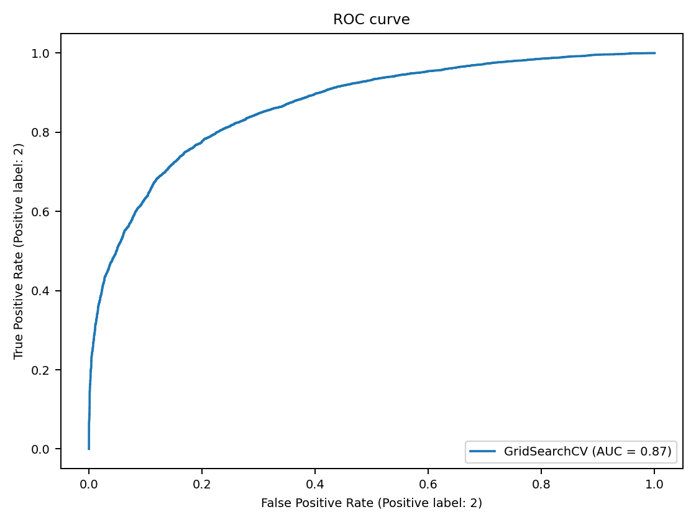
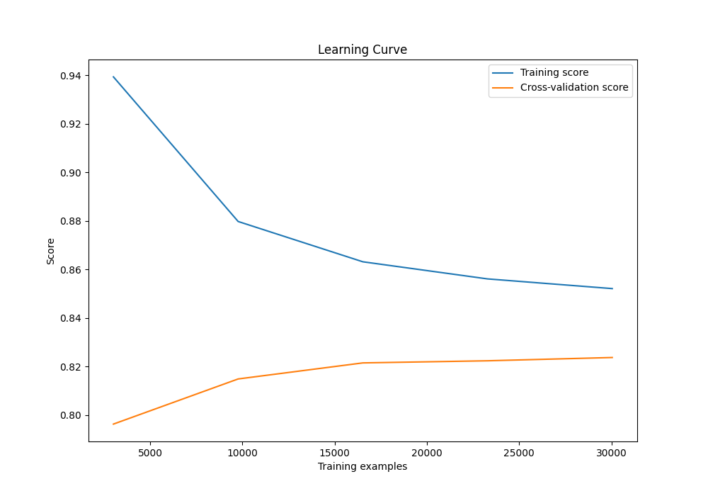

# Conclusión sobre el desarrollo del modelo

### Evaluación de los Resultados

Al analizar los resultados obtenidos con las métricas previamente establecidas, observamos varios factores que deben ser optimizados para mejorar la precisión y efectividad del modelo. Aunque el modelo de regresión logística proporcionó una base inicial, no logró un rendimiento óptimo debido a ciertas limitaciones identificadas.

El mejor modelo obtenido fue **GradientBoostingClassifier_20240602_233945**, con un 74.7% de exactitud (accuracy). Este modelo se desarrolló implementando un undersampling como método para balancear las clases en el conjunto de entrenamiento.

La matriz de confusión muestra que el modelo es efectivo para detectar pacientes de manejo ambulatorio (etiqueta 1), que en este contexto representan los negativos. En comparación con otros modelos, el Gradient Boosting obtuvo un valor de especificidad alto:

$$
Especificidad = \frac{TN}{TN+FP} = \frac{5947}{5947 + 589} = 90.99%
$$

Esto indica que cuando el modelo detecta un paciente ambulatorio, solo el 9% de las veces se equivoca. Esto lo convierte en un modelo muy adecuado para diagnóstico o confirmación, aunque no tanto para la detección de pacientes hospitalarios.

**Desempeño del Modelo:**
- La curva ROC muestra un buen rendimiento para las etiquetas 1 (Ambulatorio) y 2 (Hospitalario), con un AUC de 87%, lo que refleja un buen desempeño global del modelo independientemente del umbral seleccionado para la clasificación.

- La precisión (accuracy) del modelo es del 74.7%, pero este valor no proporciona una visión completa del desempeño del modelo, ya que es muy bueno para detectar a los pacientes ambulatorios, pero no tan efectivo para los hospitalarios.

- La curva de aprendizaje muestra una alta varianza, lo que sugiere que este modelo podría mejorar con una mayor cantidad de datos o con otras técnicas de balanceo de clases, como el oversampling.

**Desbalance de Clases:**
El desbalance de clases es un problema significativo que afecta el rendimiento del modelo, ya que puede sesgar las predicciones hacia la clase mayoritaria. Observamos este problema de manera pronunciada en los primeros modelos entrenados. Es crucial implementar técnicas que manejen adecuadamente este desbalance, como el uso de pesos de clase o la recolección de más datos de las clases minoritarias. En nuestro proyecto nos limitamos al uso de undersampling como método de balanceo.

### Comparación con la Literatura

l uso de ML en la medicina tiene como objetivo mejorar la toma de decisiones clínicas mediante el análisis de grandes volúmenes de datos médicos. La identificación precisa de los pacientes que requieren hospitalización versus aquellos que pueden ser tratados de manera ambulatoria es crucial para optimizar los recursos hospitalarios, mejorar la eficiencia del sistema de salud y proporcionar una atención adecuada a los pacientes.

Estudios recientes han demostrado que modelos más complejos como Random Forest, Gradient Boosting y redes neuronales suelen superar a los modelos simples de regresión logística en términos de precisión y capacidad de generalización. Además, el manejo del desbalance de clases mediante técnicas como el sobremuestreo (SMOTE) o el submuestreo ha mostrado mejoras significativas en el rendimiento del modelo.

- En estudios de predicción de hospitalización para pacientes con COVID-19, el GBC ha mostrado una alta capacidad para manejar múltiples variables y producir predicciones precisas sobre la severidad de la enfermedad y la necesidad de hospitalización.

- En un estudio sobre insuficiencia cardíaca, el uso de GBC permitió mejorar la detección de casos graves que requerían hospitalización, a pesar del desequilibrio en los datos.

- Al predecir la necesidad de hospitalización en pacientes con enfermedades crónicas, GBC puede manejar la interacción entre variables como la edad, comorbilidades y resultados de pruebas de laboratorio de manera efectiva.

- En aplicaciones de monitoreo de pacientes ambulatorios con dispositivos wearables, GBC ha mostrado una alta resistencia al sobreajuste, proporcionando predicciones consistentes y fiables en diferentes conjuntos de datos.

### Recomendaciones para un Modelo en Producción

Para llevar este proyecto a un modelo de producción aceptable, se recomienda:

1. **Adopción de Modelos Más Complejos:**
   - **Redes Neuronales:** Capaces de capturar relaciones no lineales complejas en los datos.

2. **Manejo del Desbalance de Clases:**
   - Implementar técnicas como el uso de pesos de clase en los algoritmos de aprendizaje.
   - Utilizar técnicas de sobremuestreo y submuestreo para equilibrar la representación de todas las clases en el conjunto de datos.

3. **Incremento y Mejora de Datos:**
   - Recolectar más datos de entrenamiento, asegurando un balance adecuado entre las clases.
   - Realizar una selección de características rigurosa para eliminar las características irrelevantes y reducir la dimensionalidad del problema.

4. **Validación y Pruebas Extensivas:**
   - Realizar validaciones cruzadas y pruebas extensivas para asegurar la robustez del modelo.
   - Evaluar el modelo en diferentes contextos y poblaciones para garantizar su generalización.

### Modelo a Retener

El modelo GradientBoostingClassifier_20240602_233945 se retiene como el modelo más prometedor para este proyecto. Este modelo no solo es conocido por su capacidad para manejar datos desbalanceados, sino que también proporciona posibilidad de explicabilidad y visualización con herramientas complementarias, y robustez al sobreajuste. Con la implementación de técnicas de manejo de desbalance de clases y una validación rigurosa, el modelo de Gradient Boosting Classifier puede ofrecer una mejora significativa en la detección temprana del dengue.

En resumen, aunque el modelo de regresión logística ha establecido una base inicial, los resultados indican la necesidad de un enfoque más sofisticado. Los modelos más complejos, como Gradient Boosting Classifier, junto con técnicas adecuadas para manejar el desbalance de clases y una mayor cantidad de datos de calidad, son esenciales para desarrollar un modelo robusto y preciso. Con estas mejoras, podemos esperar un rendimiento notablemente superior en la identificación de pacientes hospitalarios, haciendo que el modelo sea apto para su implementación en un entorno de producción.
